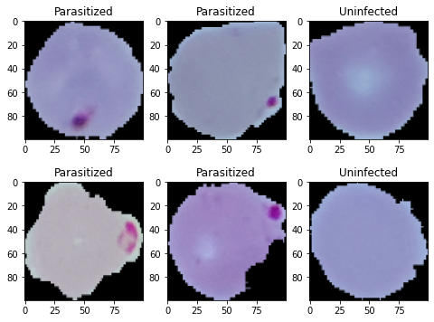
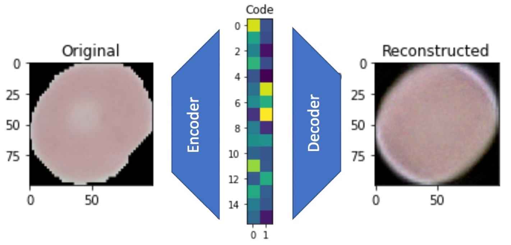
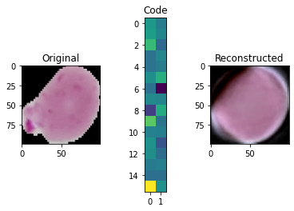
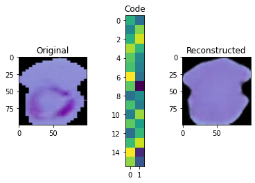

# Human-Data-Analytics

Collection of resources developed for the Human Data Analytics course at the University of Padova.

In particular, projects concern data anslysis by means of deep learning techinques.

## Overview

1. [Convolutional Neural Networks](https://github.com/nicolezattarin/Human-Data-Analytics/tree/main/CNN)

We provide two different implementations of a CNN for image classification using tensorflow and keras. The first is based on using the sequetial class from tensorflow, while the second relies on the model class. 

An example of possible dataset on which this can be applied follows:

  

2. [CNN-based autoencoder](https://github.com/nicolezattarin/Human-Data-Analytics/blob/main/CNNAutoencoders/CNN_autoencoders.ipynb) for image reconstruction and denoising

  We provide an implementation of a CNN-based autoencoder for image reconstruction and denoising.
  The dataset consists of segmented cells from the thin blood smear slide images from the Malaria Screener research activity, an example follows:

  

    
  

  The genetic model structure is:

  

    
  

  2.a) **Linear autoencoder**: first we train a linear autoencoder, working as a sort of PCA. The architecture for an image of size (N, M) and a given code_size is:
  * Encoder: flatten -> dense (code_size)
  * Decoder: dense (code_size) -> dense (N x M) -> reshape ((N, M))

  An example of the reconstruction of the imagesfollows
  

    
  

  2.b) **CNN autoencoder**: in order to increase performances we train a CNN autoencoder. An example of reconstruction follows:

  

    
  
