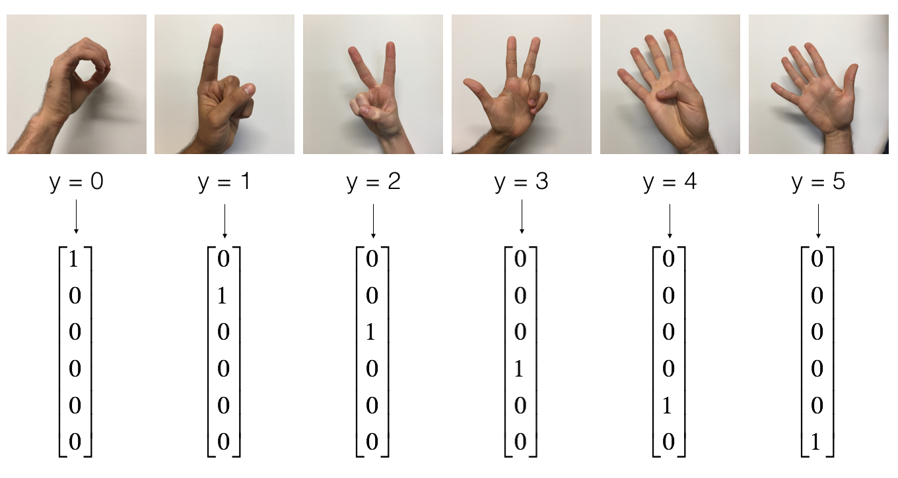
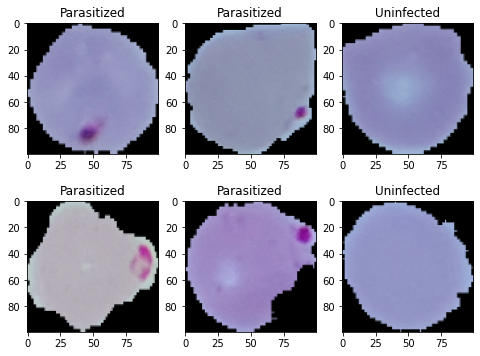

# Human-Data-Analytics

Collection of resources developed for the Human Data Analytics course at the University of Padova.

In particular, projects concern data anslysis by means of deep learning techinques.

## Overview

1. [Convolutional Neural Networks](https://github.com/nicolezattarin/Human-Data-Analytics/tree/main/CNN)

We provide two different implementations of a CNN for image classification using tensorflow and keras. The first is based on using the sequetial class from tensorflow, while the second relies on the model class. 

An example of possible dataset on which this can be applied follows:

  

2. Unsupervised learning: CNN-based autoencoder for image reconstruction and denoising

We provide an implementation of a CNN-based autoencoder for image reconstruction and denoising.
The dataset consists of segmented cells from the thin blood smear slide images from the Malaria Screener research activity, an example follows:

  

The genetic model strucrure is:

  
  

